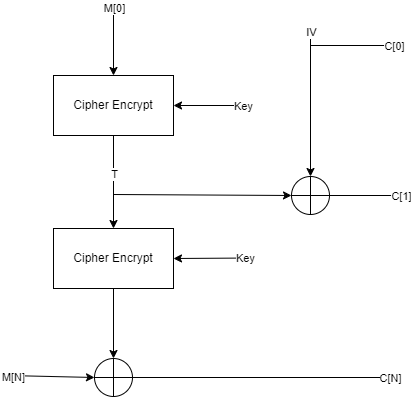
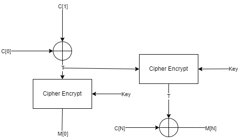

# Labo 2 Crypto
Author : Nathan Rayburn

## Mode of op

### Introduction

Encryption



Decryption 



In our current implementation, **t** functions as the key stream for the chain. The problem with this approach is that **t** is XORed with the IV after it has been generated, not before. This makes the IV completely useless... This design can be compromised if we encounter two separate messages that begin with the same 16-byte block. If this condition is met, the key stream for each subsequent iteration used to cipher the rest of the message can be decrypted. To retrieve **t**, one can simply XOR c[1] with c[0], effectively eliminating the IV from the equation.

### Cracking

c1 and c2 are the ciphertexts, IV_1 and IV_2 are the initialization vectors. If t1 equals t2, it means that we can decrypt the whole ciphered c2.  We also need m1 which is the initial plain text message for c1.

$$
t1 = c1[1] \oplus IV_1
$$

$$
t2 = c2[1] \oplus IV_2
$$

Like said, if t1 = t2, therefore : 

$$current\_stream = m1\_blocks[i] \oplus c1\_blocks[i]$$

Key stream t1 can decrypt C2 cipher and vise versa, now we can retrieve the plain text.

$$pt = current\_stream \oplus c2\_blocks[i]$$

The decrypted blocks are then concatenated together to form the decrypted message. Finally we join each block and capture the flag.

```bash
'This is a long enough message for it to be secure. The secret flag is laurels\x03\x03\x03'
```

## Enc And Mac

### Introduction
The primary security flaw in this system's implementation lies in the malfunctioning counter. The counter is initialized within a loop, causing it to reset after each iteration, thereby rendering the counter mode (CTR) ineffective. This compromises the security by negating the benefits of the keystream's uniqueness in each encryption block.

Additionally, the keystream is encrypted with 16 bytes of zeros, leading to each 16-byte block lacking any randomness. This significantly undermines the security of the system by compromising the unpredictability which is essential for robust encryption. 


### The math :)

By applying mathematical formulas, we can determine **V**, a constant utilized in both texts, which will be crucial for later decrypting our plaintext message. Additionally, we need to identify another unknown variable, sigma. Sigma is the keystream of the implementation.

We can determine sigma by subtracting our plaintext block from the corresponding ciphered text block within the same message. We can choose any block—first, second, third, etc.—since they all share the same keystream, owing to the flaw of the implementation of the counter mode (CTR).

$$
\sigma = \left( (c1\_blocks[0]) - (m1\_blocks[0]) \right) \mod p
$$

The second step is to isolate **V** like so and plug in the sigma we have found previously.


 Sigma formula :
 
$$
\sigma = \left( \text{tag1} - \sum_{i=0}^{n} m_i \cdot v \right) \mod p
$$

**V** Isolated :

$$
v = \left( \left((\text{tag1}) - \sigma\right) \times \text{{mod\_inverse}}({\sum_{i=0}^{n} m_i}, p) \right) \mod p
$$


---
The next step is to find sigma for the second message. 

We can take our MAC formula and isolate sigma.


$$
\text{{MAC = }} \sum_{i=0}^{n} m_i \cdot v + \sigma \mod p
$$

Here is sigma isolated :

$$
\sigma = \left( \text{MAC} - \sum_{i=0}^{n} m_i \cdot v \right) \mod p
$$

---

The issue is that we don't have m[i], we must find an equivalent for it. We can do so by using a formula that we have used previously. 

We can find an equivalent by using our previous formula to find sigma :

$$
\sigma = \left( c1\_blocks[0] - m1\_blocks[0] \right) \mod p
$$

By isolating our message we get this :

$$
m1\_blocks[0] = \left( c1\_blocks[0] - \sigma \right) \mod p
$$

So this is for a single block.
Now we can generalize it for all blocks of our message m[i] :

$$
\sum_{i=0}^{n} m_i = \left( \sum_{i=0}^{n} c_i - \sigma \right) \mod p
$$

$$
=> \sum_{i=0}^{n} m_i = \left( \sum_{i=0}^{n} c_i  \right) - n\cdot\sigma \mod p
$$

Isolating the sigma from the sum will be useful later since it will be totally isolated in the next equation.

---

We can finally replace the sum of m[i] in our initial formula and isolate sigma. No more unknown variables.

Initial formula of sigma isolated : 

$$
\sigma = \left( \text{MAC} - \sum_{i=0}^{n} m_i \cdot v \right) \mod p
$$

Sum of c2 blocks :

$$
\text{sumC2} = \left( \sum_{i=0}^{\text{n}} \text(c2\_blocks[i]) \right) \mod p
$$

Everything placed in a single equation to find sigma of the second message :

$$
\sigma_2 = \left( \left((\text{{tag2}}) - v \cdot \text{{sumC2}}\right) \cdot \text{{mod\_inverse}}(1 - v \cdot n, p) \right) \mod p
$$

We have finally found the sigma for the other message, this means we are ready to decrypt.

$$
\text{{plaintext}} = \bigoplus_{c2_{block} \in c2\_blocks} \left( \left( (c2_{block}[i]) - \sigma_2 \right) \mod p \right)
$$

The result of cracking the ciphered message : 

```bash
b'Congrats! The secret is cozening'
```
## HMac

### Introduction
The problem with this implementation is that it allows for the forgery of a valid MAC using a key whose value we do not know. Knowing the MAC of the last block of the message, we can forge a new message by simply appending an additional block to the original message. This flaw undermines the integrity and security of the message authentication code (MAC) system.

[](https://mermaid.live/edit#pako:eNpNkMFqwzAQRH9l2XNC7i4U7NjQQ6GQXApRKKq1rYRtychSWhPl37OuklCdpNmZx6zO2DpFWOC3l6OG192TsMCnPAjsaN6Mnk7GxQm0nLTAI6zXz-kkewgOyLZ-HkOCis1ls__ooNlWbMqILaufvWu7gznek4xke55XiwLpRiGVoObEyyNf_82bW5_8YMP7226hZbnJDEu_AbhVpH-94McEnaAUFlc4kB-kUbzoeUkKDJoGEljwVUnfCRT2wj4Zg9vPtsUi-EgrjKOSgWoj-X8GLL5kP9HlCmdBYGA)

---
### The exploit
To exploit this vulnerability, we begin by padding the last block of the original message to meet the required block size. Next, we append any value to this padded block and pad again to ensure the new block is of the correct size. We then calculate the MAC for this newly modified message by leveraging the tag from the initial message. Specifically, we use AES to encrypt the original tag, using the newly generated block as the key. The output of this encryption is XORed with the original tag to produce a new tag. This method allows us to forge the MAC without knowing the actual encryption key, effectively bypassing the security measures.

**m**            is our original message that we want to forge.

**previous_mac** is the tag that was generated with the original message.

**new_amount** is the amount we want to add to our transaction, in this case this is the value we want to forge into our message.

```python
def verify(message, key, tag):
    return mac(message, key) == tag

def create_new_message(m, previous_mac, new_amount):
    m = pad(m) # pad the last block
    m += new_amount # add amount to create a new block
    mPrime = m # retrieve forged message
    m = pad(m) # pad the block to calculate the new tag
    blocks = [m[i:i + 16] for i in range(0, len(m), 16)] # transform into blocks
    # calculate the new mac for the last new block that has been added
    h = previous_mac
    h = strxor(AES.new(blocks[-1], AES.MODE_ECB).encrypt(h), h)
    return h, mPrime
```
So now we have **mPrime** that will be able to validate the verify function with our new tag without knowing the value of the **key**.

```python
verify(m, k, mc) # return = true, m = original message, k = orignal key, mc = tag
verify(mPrime, k, newMac) # return = true, mPrime = our modified message, k = still the original key, newMac = says for it self

```
This is an issue because knowing that our intended message was :

```bash
'Sender: Alexandre Duc; Destination account 12-1234-12. Amount CHF123'
```

We were able to make a new message tho it's still passing the verification, turning to this :
```bash
`Sender: Alexandre Duc; Destination account 12-1234-12. Amount CHF123           800`
```

---
